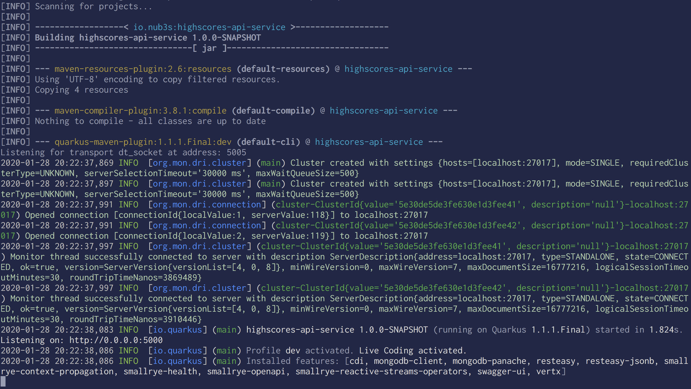

# High Scores API Service

An API service that showcases how [Quarkus](https://quarkus.io/) can make it easy to expose REST endpoints and tie them to MongoDB. This project also shows other benefits we get from Quarkus like hot deploys, active-record like ORM access, service health checks, and easy containerization/deployment on OpenShift.

I initially started designing this API with [Apicurito](https://github.com/Apicurio)) and exported that as an OpenAPI specification. Then after I coded my app, I now let Quarkus auto-create that specification and swagger-webpage for me on the fly.

## Running this
There are several ways to run this. If you don't understand the differences, just go with option 1. I've included the others here for other deployment and testing scenarios that might be needed.

### Option 1 - Running locally
Start a local mongoDB server with:
>`mkdir -p ./data/db`
>`mongod --dbpath ./data/db` 

Run the api service in dev mode that enables live coding using:
>`./mvnw quarkus:dev`

### Option 2 - Packaging and running the application
The application is packageable using `./mvnw package`. It produces the executable `highscores-api-service-1.0.0-SNAPSHOT-runner.jar` file in `/target` directory. Be aware that it’s not an _über-jar_ as the dependencies are copied into the `target/lib` directory.

The application is now runnable using `java -jar target/highscores-api-service-1.0.0-SNAPSHOT-runner.jar`.

### Option 3 - Creating a native executable
You can create a native executable using: 
>`./mvnw package -Pnative`.

Or you can use Docker to build the native executable using:
>`./mvnw package -Pnative -Dquarkus.native.container-build=true`.

You can then execute your binary:
>`./target/highscores-api-service-1.0.0-SNAPSHOT-runner`

### Option 4 - Deploying from local to OpenShift
TBD

### Option 5 - Deploying from GitHub to OpenShift
TBD

## Hooking in 3scale API Management
TBD - [3scale ref here](https://access.redhat.com/documentation/en-us/red_hat_3scale_api_management/2.7/html/providing_apis_in_the_developer_portal/create-new-service-openapi-specification#using_openapi_specification)

## Thanks and Credit
This service was built based on guidance from the [Quarkus example here](https://quarkus.io/guides/openapi-swaggerui#loading-openapi-schema-from-static-files).